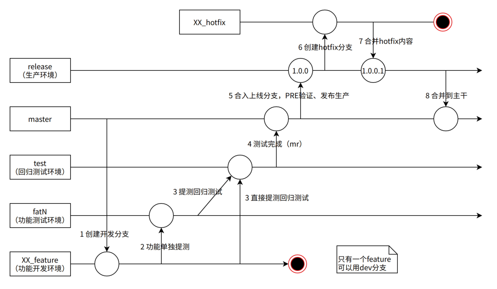

# 代码分支规范与发布环境

## 分支流程

 

### 分支说明

master：仅包含待上线代码

test：回归测试分支；部署测试环境；仅包含待上线的已提测代码

dev：开发环境

fatN：fat1、fat2、...；功能测试分支；

feature_XX：个人开发分支；对应每个迭代的需求，XX为功能简写；例如feature_media_app_；功能开发分支必须以_feature开始，merge后删除

release：上线分支；打tag部署上线环境；MMDD为上线时间

hotfix_XX：线上bug修复分支

### 流程举例

#### 开发

1. RD新建feature_XX分支

2. 开发代码，自测完成

3. 发起代码review

4. feature_XX分支部署开发环境联调，直到联调通过

5. 与QA沟通是否可发布到fatN环境

6. RD发起merge request合并feature_XX分支到fatN分支

7. QA点击接受merge

8. 代码库owner过code review，确认合并

9. 发提测邮件，与QA确认后

#### 功能测试

1. QA用fatN分支部署fatN环境

2. RD在fatN分支修bug，提交

3. QA更新fatN测试环境，测试完成

#### 回归测试

4. RD发起merge request合并到test环境（判断可以在下一个窗口发布的情况下才能合并）

5. QA点击接受merge

6. 代码库owner过code review，确认合并

7. QA用test分支部署测试test环境

8. RD在test环境修bug，提交

9. QA更新test环境，回归测试完成

#### 上线

1. RD发起merge request 合并test分支到master分支

2. QA点击接受merge

3. 代码库onwer确认合并

4. QA确认上线内容都已合并到master，merge到release分支，打tag（3位版本号）

5. QA用tag发布到pre环境验证

6. QA使用pre产物发布到生产环境

#### Hotfix

1. RD新建hotfix_XX分支

2. 开发修复问题，自测完成（可以dev环境验证）

3. RD合并hotfix_XX分支到release分支；发布merge request

4. QA点击接受merge

5. 代码onwer过code review，确认合并

6. QA确认上线内容都已合并到master，merge到release分支，打tag（3位版本号）

7. QA用tag发布到pre环境验证

8. QA使用pre产物发布到生产环境

#### delay

延期上线的功能，研发需确保从test和master分支回滚

## 部署环境

### 1、开发环境（DEV）

个人开发分支，新建feature_XX分支。

个人分支feature_XX开发完成自测后，合并到dev

### 2、功能测试环境（FAT1、FAT2...）

仅从fat1，fat2...分支发布

新环境fatN可以快速部署

当测试环境不够用的时候启动多套功能测试环境，在迭代周期内需合并到TEST回归测试环境，才能进入发布流程

### 3、回归测试环境（TEST）

仅从test分支发布

合并到master分支前必须在该环境进行回归测试

### 4、预发布环境（PRE）

仅从release分支发布

不是预发布环境，不与生产环境共用资源

合并到master后，发布到PRE快速验证，没问题同一个打包产物直接上线（灰度+放量）

### 5、生产环境（PROD）