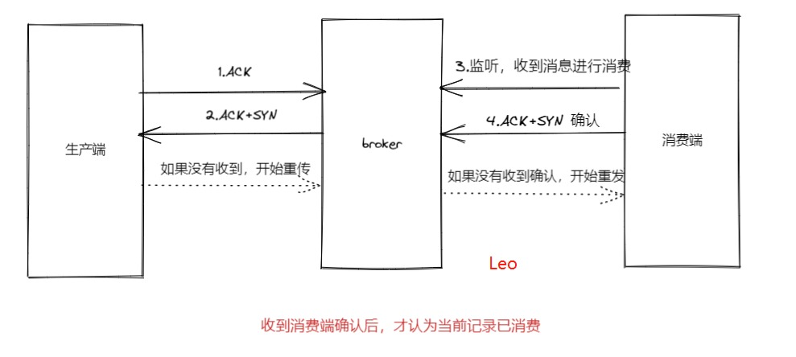

幂等性

**概念**：用户对同一操作发起一次或多次请求的结果都是一致的，不会产出任何副作用。常见的幂等有接口的幂等、消息的幂等。在分布式系统中必须要考虑的一个方面。

## 产生接口幂等的原因：

网络波动，可能会引起重复请求。

定时任务重复执行

使用了失效或超时重试机制（Nginx重试、RPC重试或业务层重试等）

用户重复操作，用户在操作时候可能会无意触发多次下单交易，甚至没有响应而有意触发多次交易应用

用户多次点击提交按钮

页面重复刷新

使用浏览器后退按钮重复之前的操作，导致重复提交表单

使用浏览器历史记录重复提交表单

浏览器重复的HTTP请求

 

## 常见会出现幂等问题的业务：

1. 订单创建接口：在创建订单时，第一次调用返回超时了，重试机制一般会再次调用这个接口。此时我们不能因为这个接口被调了两次，就创建两个一样的订单；因此需保证幂等性。
2. 库存扣减接口
3. 支付接口
4. 定时任务接口


## 接口中常见的幂等问题

### 新增接口：

新增操作多次请求可能会产生重复数据。

### 更新接口：

如果是单纯的更新数据，比如：update account set money=100 where id=1，是没有问题的。如果还存在计算，比如：update account set money=money+100 where id=1，这种情况可能会导致数据错误。


## 消息常见的幂等问题

在支付场景下，消费者消费扣款消息，对一笔订单执行扣款操作，扣款金额为100 元。如果因网络不稳定等原因导致扣款消息重复投递，消费者重复消费了该扣款消息，可能会造成多次扣减金额操作。

如果最终的业务结果是只扣款一次， 扣费 100 元，且用户的扣款记录中对应的订单只有一条扣款流水，不会多次扣除费用。那么这次扣款操作是符合要求的，整个消费过程实现了消费幂等。


消息重复的原因



### 1.发送时消息重复

当生产者发送消息给broker，此时出现了网络闪动或mq宕机，导致mq对生产者的应答失败。生产者此时会认为发送失败并尝试再次发送消息，消费者随后会收到两条相同的消息。

### 2.投递时消息重复

消费端已经消费了消息，在发送应答确认的时候，mq产生网络波动，未收到反馈应答。mq恢复后再次投递消息，消费端再次消费。

### 3.负载均衡消息重复

当消息队列的服务端或消费者重启、扩容或缩容时，都有可能会触发 rebalance，此时消费者Consumer可能会收到重复消息。 


既然产生了消息重复，那么要解决这个一问题。我们需要从生产者、中间件、消费者不同的层面来保证消息的幂等。


最有效的方式：保证消费的接口幂等。


## 前端设计

### 1.按钮只能点击一次

 用户点击按钮后，将按钮置灰，或者显示loading状态。

### 2.页面重定向-PRG模式

 PRG模式，即 `Post-Redirect-Get`，当客户提交表单后，去执行一个客户端的重定向，跳转到提交成功页面，避免用户按F5刷新导致的重复提交，也能消除按浏览器后退键导致的重复提交问题。目前绝大多数公司都是这么做的，如淘宝，京东等。


## 后端设计


### 方案一：select+insert+唯一索引冲突

数据库字段添加唯一索引，保存数据先去数据库查一下，看下有没有这条数据，然后再插入。

适合场景单一，只能是提前知道插入或者更新的id，例如插入券码，券码是唯一的，可以使用唯一索引，防止重复插入。但是没有唯一字段的接口就不适合这种方案。


### 方案二：抽取防重表

额外使用一张表，保存的时候先将唯一字段数据插入防重表，插入失败表示有重复，插入成功没有重复数据，可以执行接下来的业务。


### 方案三：token令牌

获取用户token，进行md5加密，加上业务前缀，将数据保存到redis中，然后执行业务，执行完成，删除redis中的key。


### 方案四：乐观锁

适用于更新操作

给表的加多一列`version`版本号，每次更新记录`version`都升级一下（`version=version+1`）。具体流程就是先查出当前的版本号`version`，然后去更新修改数据时，确认下是不是刚刚查出的版本号，如果是才执行更新。

比如，我们更新前，先查下数据，查出的版本号是`version =1`

```SQL
select order_id，version from order where order_id='666'；
```

 然后使用`version =1 `和`订单Id`一起作为条件，再去更新

```SQL
update order set version = version +1，status='P' where  order_id='666' and version =1
```

 最后更新成功，才可以处理业务逻辑，如果更新失败，默认为重复请求，直接返回


### 方案五：分布式锁

分布式锁实现幂等性的逻辑就是，请求过来时，先去尝试获得分布式锁，如果获得成功，就执行业务逻辑，反之获取失败的话，就舍弃请求直接返回成功


### 方案六：设置业务唯一key（应用广泛）

生产者消息体中构造一个唯一key，消息针对这个key加分布式锁。

在消费端，创建一个消息防重表，利用插入记录唯一健约束控制与业务有一定的耦合，另外高并发下频繁对消息防重表进行操作，性能比较低，不太建议使用。

数据库业务表加唯一索引。


### 方案七：设置全局唯一id


方案对比


## 项目中使用规范：

必须使用唯一索引防重。

update数据不能出现计算，更新接口必须支持幂等。

使用状态机更新状态，防止业务状态随意转变。[状态机规范](状态机规范.md) 