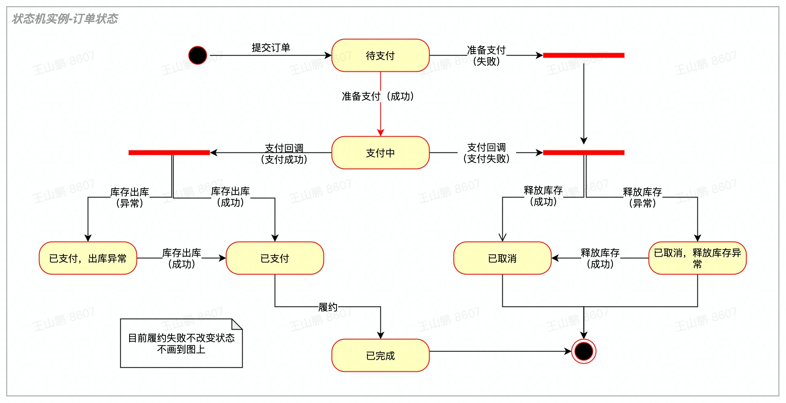
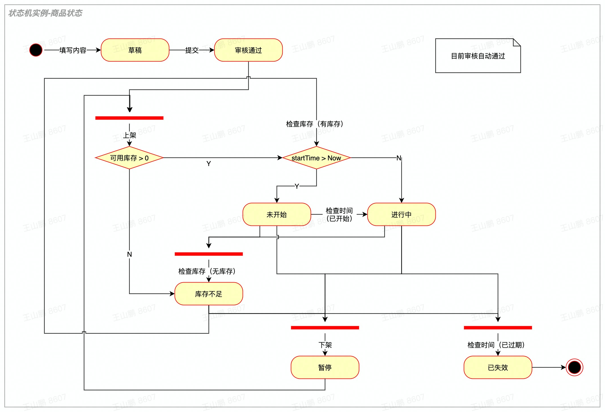

## 一、状态机图

### 1、工具规范

- 工具使用draw.io，保存为svg格式
- 标准的状态图，不要用其他图和其他组件

### 2、名词解释

- 事件：
  - 就是操作，客户出发的操作，或者系统自动触发的操作，必须是动词
  - 事件完成后可能不同的结果会转移到不同的状态，那么事件为带结果事件，表述为“事件（结果）”
  - 本文“事件”默认可以带结果
- 串联事件：

一个事件发生后，不能马上更改状态，还要再触发一个事件，拿到结果之后再设置状态，这两个事件一起算一个串联事件

- 合并事件：

多个状态通过同一个事件转移到某一个状态，这种情况需要转移到Join横条，Join后为该事件，Join前的连接不是事件，仅表达合并关系

- 条件事件：

一个事件转移到一个条件后会转移到不同的状态

- 条件和事件结果的区别
  - 条件是根据参数实体即可确定的状态，与事件无关
  - 事件结果，是外部事件的结果，与参数实体的状态无关

### 3、设计规范

- 所有动作可带结果
- 组件
  - 所有圆角矩形，都是状态（draw.io中叫“activity”的那个圆角矩形，实际上是状态）
  - 所有线都是“事件”，或者“事件（结果）”，事件名称都写在线的末端
  - Fork/Join横条，仅在串联事件和合并事件中可用
  - Condition条件都是根据实体的状态可以判断的，不属于事件的结果
  - 要有起始态，表意为“未设置状态”，实际枚举值为0
  - 要有终点态，虚拟状态，指向终点状态的状态是最终状态，指向终点态的线不表达事件
- 禁止
  - 不允许使用其他组件，除了注释
  - 不允许使用子状态，太乱
  - 同一个“事件（结果）”不允许有两条线，可以接Fork/Join横条
- 用法要求：
  - 每个组件，左边和上边是输入动作，右边和下边是输出动作（本条为确保图形不会太乱）
  - 线有交叉的情况，要选择跨线-锐利
  - 串联事件发生时，必须使用Fork横条连接多个事件
  - 合并事件发生时，必须使用Join横条，Join前的连接无名称，Join后的连接代表该事件
  - 条件事件发生时，条件后的连接仅为条件结果，不是事件，条件前的连接为该事件
  - 如果有进入同一个状态的相同事件，必须画成合并事件

### 3、实例-订单状态机



### 4、实例-商品SPU状态机



## 二、状态机代码

### 1、状态定义规范

- 状态字段使用short类型
- 状态字段名称为status，或者Status后准如xxxStatus
- 状态枚举值的常量Interface
- 状态枚举常量Interface放在实体类中
- 图中圆角矩形状态与状态值常量严格一一对应，起始状态固定为0，可以定义为short INVALID = 0
- 实例：

```java
 public class Order {
     / 状态，xxx */
     public static interface Status {
         / 未设置 */
         short INVALID = 0;
         / 待支付 */
         short TO_BE_PAID = 1;
         / 支付中 */
         short PAYING = 2;
        ...
         / 支付中 */
         short PAID_WITH_STOCK_ERR = 6;
        ...
    }
     / @see Status */
     private short status;
    ...
     /* 只能通过 @see OrderStatusMachine 访问 */
     public void setStatus(short status) {
         this.status = status;
    }
 }
```


### 2、状态机定义规范

- 状态机接口和实现规范
  - 名称为三段：实体名+状态字段名+Machine，采用驼峰命名法，如OrderStatusMachine或者OrderAuditStatusMachine（假设有个字段为auditStatus）
  - 状态机必须定义接口，并放在module的impl.statusmachine包中，如order.impl.statusmachine.OrderStatusMachine接口
  - 状态机接口的实现，与接口放同一个package中即可，设计评审只看接口
- 状态机方法名称
  - 方法名是“事件名称+With+事件结果”，actionWithResult，如payCallbackWithPaid
  - 方法名中如果没有With事件结果，表示事件成功
  - 如果是串联事件，方法名称为“事件1With结果1And事件2With结果2”，如payCallbackWithPaidAndOutInventoryWithErr
- 状态机方法规范
  - 方法只能有一个参数：实体对象
  - 状态机方法，只能设置参数实体对象的属性，除此之外只能查询，不能去更改任何存储的状态
  - 状态机方法中尽量使用switch语句
- 状态机方法返回值
  - 固定为boolean
  - 转移状态失败抛异常
  - 转移后状态有变化，返回true
  - 转移后状态无变化，返回false，效果与未调用方法相同
- 图中事件（含串联事件、合并事件、条件事件）与状态机的方法严格一一对应
- 实例

```java
public interface OrderStatusMachine {
     / 提交订单 */
     boolean submitOrder(Order order);
     / 准备支付（成功） */
     boolean prepareForPay(Order order);
     / 准备支付（失败），释放库存（成功） */
     boolean prepareToPayWithErrAndOutInventory(Order order);
     / 准备支付（失败），释放库存（失败） */
     boolean prepareToPayWithErrAndOutInventoryWithErr(Order order);
    ...
 }
```


## 三、遗留讨论

-  状态原因如何设计（short... statusReasons）？事件方法内确定还是外部确定，如果确定状态原因有更新
-  事件方法里，能否更新状态以外的属性？如何界定？
- 判断是查询系统某些状态的，如果查询的结果不论状态是否变化都要保存，怎么做？如广告创意状态图中的，“检查投放条件”判断，是需要调用若干外部接口查询条件，并保存在状态的原因里