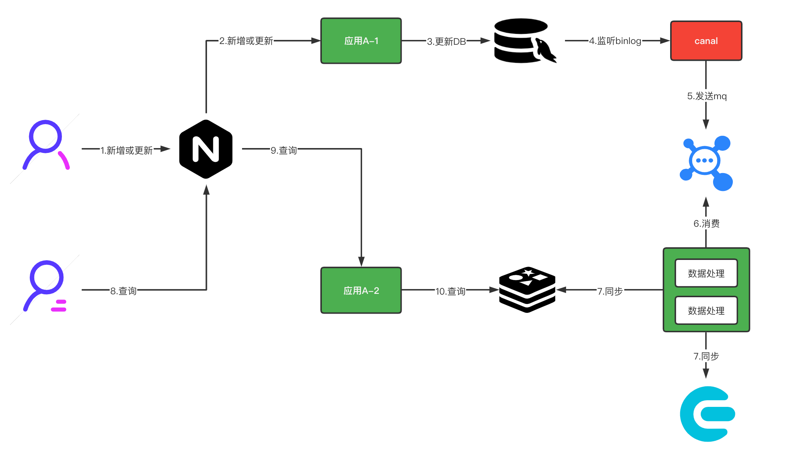
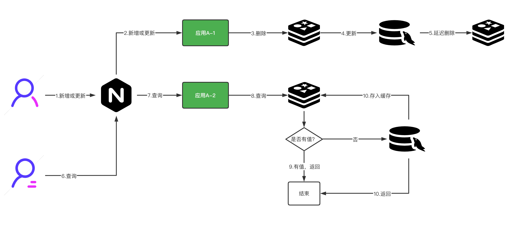
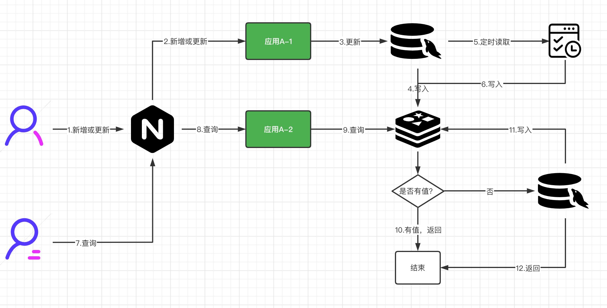
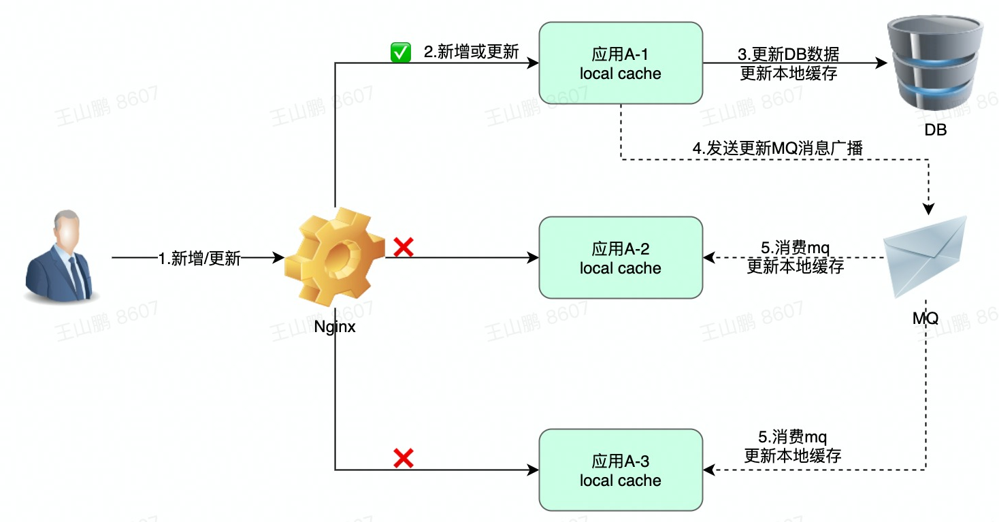
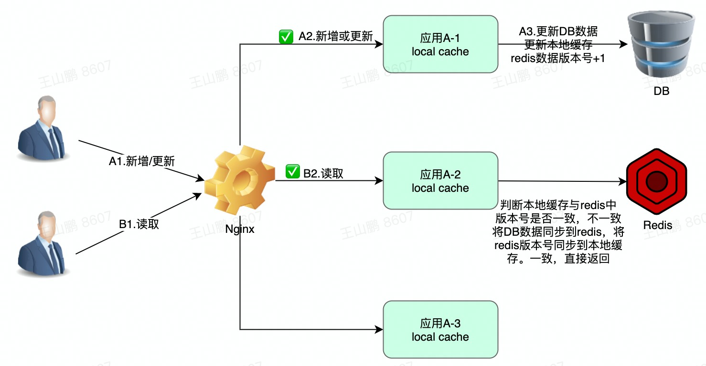

# 【方案】缓存与DB数据一致性

> 为了增加服务的吞吐量，减少数据库压力，提高查询效率，首先想到的引入缓存。但同时也让架构变得复杂，所以要谨慎使用本地缓存。
>
> 一般我们习惯把热点数据放到本地缓存中，非热点数据放到分布式缓存
>

## 一、名词解释

| **名词**     | **常见缓存**                                  |
| ------------ | --------------------------------------------- |
| `本地缓存`   | HashMap、CurrentHashMap、GuavaCache、Caffeine |
| `分布式缓存` | Redis、Memcache                               |

高并发项目中数据一致性通常指本地缓存、分布式缓存、mysql数据库三者之间数据一致性。

**数据不一致场景**

- 本地缓存与mysql数据不一致
- 分布式缓存与mysql数据不一致

## 二、redis与DB一致性

### 1.基于binlog方案（⭐️推荐）

a、更新 db 数据 

b、通过 canal 中间件监听 mysql binlog，同时将数据同步到 mq 

c、启动一个数据处理应用，消费 mq 数据并进行数据加工 

d、将加工后的数据写入 redis 和 es 

e、查询 redis 数据返回 

**优点：** 

方案比较松耦合，吞吐量大。

**缺点：** 

引入了多个中间件，比如 canal、kafka，还引入了数据处理程序，比较复杂。

### 2.延迟双删方案

可以使用springAop切面增强方法进行延迟删除缓存。

先进行缓存清除，再执行 update sql，最后（延迟 N 秒）再执行缓存清除。 

上述中（延迟 N 秒）的时间要大于一次写操作的时间，一般为 3-5 秒。 

原因：如果延迟时间小于写入 redis 的时间，会导致请求 1 清除了缓存，但是请求 2 缓存还未写入的尴尬。 

注意：一般写入的时间会远小于 5 秒 

**优点：** 

方案相对比较简单，对于非高并发业务比较适合。 

**缺点：** 

a、有等待环节，如果系统要求低延时，这种场景就不合适 

b、不适合秒杀这种频繁修改数据和要求数据强一致的场景 

c、延时时间是一个预估值，不能确保 mysql 和 redis 数据在这个时间段内都实时同步或持久化成功了

### 3.基于定时任务方案

a、更新 db 数据，同时写入数据到 redis 

b、启动一个定时任务定时将 db 数据同步到 redis 

c、前端发起接口查询请求，先从 redis 查询数据 

d、redis 没有数据，加一个分布式锁，再从 redis 数据查询 

e、查询 redis 数据返回 

**优点：** 

方案相对比较简单，对于高并发业务比较适合。相对是一个比较高可用的方案，通过定时任务定时更新 db 数据到 redis，保持数据的一致性。 

**缺点：** 

暂无

### 4. 项目常用方案

1. 删除缓存后，更新DB
2. 更新DB后，再删除缓存
3. 更新缓存后，再更新DB
4. 更新DB后，再更新缓存

**优点：**

使用方便，逻辑简单

**缺点：**

会造成数据不一致问题

建议不强依赖缓存、对数据一致性要求不高的项目，可以使用

## 三、本地缓存与DB一致性

### 1.MQ方案（⭐️推荐）

### 2.Redis方案

如果有的小项目没有mq，可以用redis。

本地和redis中加一个版本号，每次读取对比版本号是否一致，一致返回，不一致更新缓存数据，redis版本号更新，保证redis与数据库版本号和数据一致。

新增或更新，本地的版本号更新，同步到redis。

暂时无法在文档外展示此内容

