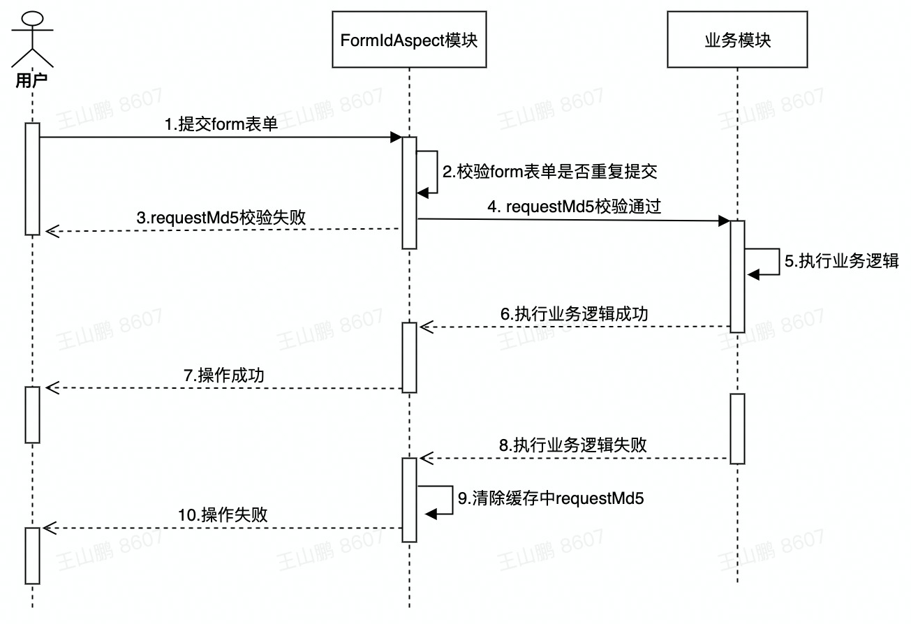
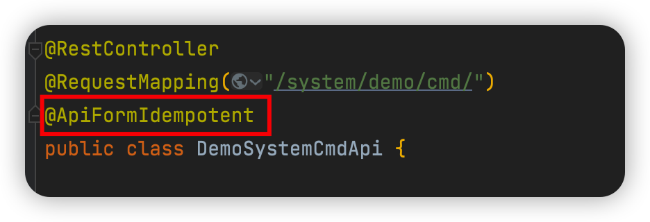

## 一、表单重复提交概念及造成原因

**概念：**重复多次的提交同一表单内容。

**造成原因：**

1、用户在首次点击提交之后，在没有收到提交成功提示下，再次点击提交按钮。

2、用户提交完表单之后，刷新网页。

3、用户提交表单后，点击浏览器的【后退】按钮回退到表单页面后进行再次提交。

4、不明原因重复提交表单

## 二、服务端解决方案

1. #### 时序图



1. #### **场景特点：**

- 面向对象：H5，App

1. #### **规范描述：**

- 配置缓存失效时间 > 接口响应时间

1. #### **实现方式：**

自定义注解+AOP+Redisson

**缓存key生成规则**：**applicationName** + ":" + "**requestMd5**" + ":" + **requestMd5Value**

**requestMd5生成规则**：请求参数+ 用户ID + 用户ip  生成MD5，作为requestMd5Value

1. 自定义注解：@ApiFormIdempotent
2. 切面注解：

@Pointcut：定义切入点

@Before：业务方法执行前切入内容

@AfterThrowing: 业务方法出现异常之后切入内容

@AfterReturning: 业务方法执行完成后切入内容

1. #### 方案优点：

- 使用方式简单，只需要在类上加@ApiFormIdempotent注解即可



- 拦截粒度细，以类为切面做幂等。
- 业务方法执行异常，自动清除幂等缓存标识，不影响重新操作逻辑。

## 使用说明

1. 更新最新版脚手架，因需要用到公共切面中的用户ID，IP等信息，consumer/admin/advertiser端 的cmd接口需要在类上加个@ApiFormIdempotent注解，system接口不支持接入。
2. 把consumer/admin/advertiser切面中的获取的用户ID，保存到公共切面CallCtx.CommonAuthCtx.myUserId中一份。
3. 在aop包下，新建idempotent.form包，添加如下两个文件

```Java


@Target({ElementType.TYPE})
@Retention(RetentionPolicy.RUNTIME)
public @interface ApiFormIdempotent {}


@Aspect
@Slf4j
public class ApiFormIdempotentAspect {

    @Resource
    private RedissonClient redissonClient;

    private static final String REQUEST_MD5 = "requestMd5";

    @Value("${spring.application.name}")
    private String applicationName;

    @Value("${self.api.formIdempotent.expire}")
    private long expire;

    /**
     * 定义切入点为 带有 @ApiIdempotent 注解的类
     */
    @Pointcut("@within(com.cloud.eagllwin.engagement.aop.idempotent.form.ApiFormIdempotent)")
    public void apiFormIdempotent() {
    }
    
    @Before("apiFormIdempotent()")
    public void beforePointCut(JoinPoint joinPoint) {
        String sign = DigestUtils.md5Hex(buildEncryptionParam(joinPoint));
        // redis中添加requestMd5
        boolean result = redissonClient.getBucket(buildCacheKey(sign)).trySet(sign, expire, TimeUnit.MILLISECONDS);
        if (!result) {
            throw new ApiException(1010, "repeated submission.");
        }
    }
    
    @AfterThrowing(pointcut = "apiFormIdempotent()")
    public void afterThrowing(JoinPoint joinPoint) {
        String sign = DigestUtils.md5Hex(buildEncryptionParam(joinPoint));
        // 接口发生异常，清掉redis中requestMd5
        redissonClient.getBucket(buildCacheKey(sign)).delete();
    }

    @AfterReturning(pointcut = "apiFormIdempotent()", returning = "resp")
    public void afterPointCut(JoinPoint joinPoint, Object resp) {
        if (resp instanceof ApiResp) {
            ApiResp<?> apiResp = (ApiResp<?>) resp;
            // 接口非正常响应
            if (!apiResp.success()) {
                String sign = DigestUtils.md5Hex(buildEncryptionParam(joinPoint));
                // 清掉redis中requestMd5
                redissonClient.getBucket(buildCacheKey(sign)).delete();
            }
        }
    }
    
    /**
     * 构建cacheKey
     *
     * @return
     */
    private String buildCacheKey(String requestMd5Val) {
        return applicationName + ":" + REQUEST_MD5 + ":" + requestMd5Val;
    }


    /**
     * 构建加密参数
     *
     * @param joinPoint
     * @return
     */
    private String buildEncryptionParam(JoinPoint joinPoint) {
        // 获取post请求requestBody数据
        Object[] args = joinPoint.getArgs();
        if (Objects.isNull(args) || args.length < 1) {
            return StringUtils.EMPTY;
        }
        String myUserId = Objects.isNull(CallCtx.ctx().getCommonAuthCtx()) ? StringUtils.EMPTY : CallCtx.ctx().getCommonAuthCtx().getMyUserId();
        List<Object> params = Arrays.stream(args).collect(Collectors.toList());
        // 获取用户ID
        params.add(myUserId);
        // 获取IP
        params.add(CallCtx.ctx().getClientIp());
        log.info("traceId:{}, myUserId:{}, ip:{}, encryptionParam:{}", CallCtx.ctx().getTraceId(), myUserId, CallCtx.ctx().getClientIp(), params);
        return params.toString();
    }

}
```

1. 添加配置文件
   1. 添加ApiFormIdempotentConfig配置文件

```Java

@Configuration
@ConditionalOnWebApplication  // 只有web应用才生效
@ConditionalOnProperty(prefix = "self.api.formIdempotent", value = "enable", havingValue = "true")
public class ApiFormIdempotentConfig {

    @Bean
    public ApiFormIdempotentAspect apiFormIdempotentAspect() {
        return new ApiFormIdempotentAspect();
    }

}
```

1. 添加RedissonConfig配置文件(若项目中已经存在redisson相同配置，redisson配置可以省略)

```Java

@Configuration
public class RedissonConfig {

    @Value("${self.redis.address}")
    private String address;

    @Value("${self.redis.timeout}")
    private Integer timeout;

    @Value("${self.redis.connectionPoolSize}")
    private Integer connectionPoolSize;

    @Value("${self.redis.connectionMinimumIdleSize}")
    private Integer connectionMinimumIdleSize;

    @Bean
    public RedissonClient redissonClient() {
        Config config = new Config();
        config.setTransportMode(TransportMode.NIO);
        // 默认配置 JsonJacksonCodec序列化
        config.setCodec(JsonJacksonCodec.INSTANCE);
        SingleServerConfig singleServerConfig = config.useSingleServer();
        // 连接地址
        singleServerConfig.setAddress(address);
        // 连接超时时间
        singleServerConfig.setConnectTimeout(timeout);
        // 连接池最大容量      
      	singleServerConfig.setConnectionPoolSize(connectionPoolSize);

        // 最小保持连接数
  singleServerConfig.setConnectionMinimumIdleSize(connectionMinimumIdleSize);
        return Redisson.create(config);
    }
}
```

1. 开启幂等功能，同时配置redisson(若项目中已经存在redisson相同配置，redisson配置可以省略)

```YAML
# redisson 配置
self.redis.address = rediss地址
self.redis.timeout = 1000
self.redis.connectionPoolSize = 10
self.redis.connectionMinimumIdleSize = 1

## 接口防重配置
# 开关：true-开启，false-关闭
self.api.formIdempotent.enable = true
# 过期时间(单位:ms)
self.api.formIdempotent.expire = 根据接口相应时间配置
```

## 注意事项

1. 并不是所有cmd接口都需要加防重，需根据业务判断，按需添加
2. 接口加防重对接口性能有一定影响

## 错误代码【code】

| 错误代码 | 错误类型             |
| -------- | -------------------- |
| 1010     | repeated submission. |


幂等的纪要：

1.幂等应该考虑约束前端的生成规则和场景，最好是通过前端协议封装一个sdk调用方式来约束

2.后端约束尽量使用算法去动态控制内部实现方案，不需要暴露缓存定制时间和key生成，因为用户使用习惯不同，容易导致幂等失效

3.要考虑requestId和业务是否耦合的情况，比如请求技术场景下，没有传递requestId到后端方法，会导致幂等失效

4.先通盘考虑整个方案的面向用户和使用场景，先罗列出来一些核心的要解决的问题，再设计技术方案

5.要有一个完整的方案，并且要让前端后端和测试都知晓，对齐技术解决方案，比如增加开关，测试环境下关闭幂等，降低测试成本。后续的话，收集下更多方的建议。

6.使用现有的缓存的方案的话，考虑下资源的问题，如果资源不够，是否考虑监控，动态扩容，如果有的大促的话，压力上来，你的缓存是否够用，需要调整方案。


场景特点：

1.前端

2.前端操作者清楚提交数据会影响后端状态

方案：

1.前端每次提交携带formId

2.前端页面不刷新，formId不能修改

3.formId: 使用uuid


1.规范描述

2.补充图形描述

3.formId字段名称定义

4.错误码code重新定义

5.论证这个方案的好处（场景描述，图等）

6.补充重复提交定义